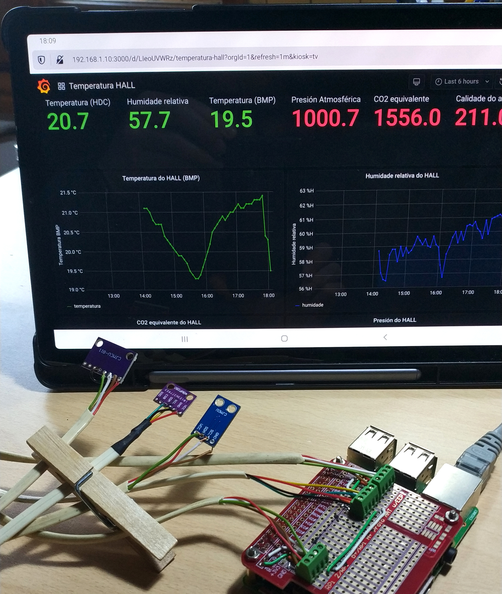

# Servidor para IoT sobre RaspberryPi (para uso en interiores)
You can read a previous version of this file in the <a href="README_en.md">english version</a>

Con este proxecto conseguimos usar unha Rasperry Pi 2 ou superior como unha _centralita_ de dispositivos IoT. Ademais conectaremos ao seu porto GPIO un ou máis sensores que nos aportarán datos do lugar onde esta instalada a Raspi.

## Software
Configuración e posta a punto do servidor IoT sobre RaspberyPi. Ofrece diferentes servizos para un sistema de IoT básico:

* Sistema Operativo de base: [Raspberry Pi OS Lite](https://www.raspberrypi.org/software/)
* Servidor de mensaxería MQTT: [Mosquitto](https://mosquitto.org/)
* Servidor de base de datos IoT: [InfluxDB](https://www.influxdata.com/products/influxdb/)
* Servidor de gráficos de datos: [Grafana](https://grafana.com/)

## Scripts en Python
+ Scripts en Python que __leen os datos__ dos diferentes sensores. Estes datos son publicados como mensaxes MQTT.
* Scripts de SystemD que inician automáxicamente os anteriores scripts como __servizos__.

| Magnitude | Sensor | Script de lectura (/sensors) | Servizo (/services) | Documentación |
|---| --- | --- | --- | --- |
| Temperatura e Presión Atmosférica | BMP280 | BMP280_mqtt.py | bmp_mqtt.service | [BMP280 HowTo](documentacion/bmp280_howto.md) |
| Temperatura e Humidade Relativa | HDC1080 | HDC1080_mqtt.py | hdc_mqtt.service | [HDC1080 HowTo](documentacion/hdc1080_howto.md) |
| Calidade do aire | CCS-811 | CCS811_mqtt.py | ccs_mqtt.service |  |
| Temperatura e Humidade Relativa | DHT22 | ─ | ─ | Non recomendado

* Script en Python que extrae os datos de certas mensaxes MQTT e os escribe na base de datos InfluxDB: [influxdb_mqtt.service](services/influxdb_mqtt.service)
### Por facer (TO-DO)

- [x] Ordenar os arquivos e scripts de forma coherente e sinxela

- [ ] Crear arquivo de configuración para centralizar variables como enderezos IP, topics, acceso Wifi, etc.
- [ ] Habilitar acceso seguro desde o exterior aos datos
- [ ] Publicar os datos dos sensores en formato JSON

## Hardware

* Adaptación dunha protoboard para conectar os diferentes sensores aos terminais I2C do GPIO

### Por facer (TO-DO)

- [ ] Incluir a comunicación por LORA Monocanle
