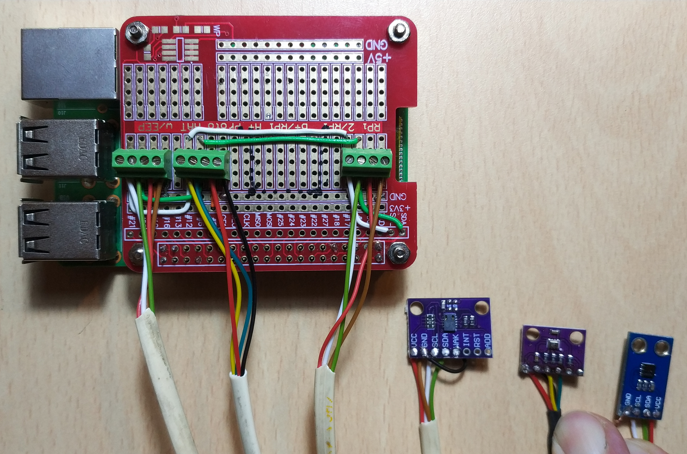

# Servidor para IoT sobre RaspberryPi

NOTE: In the near future there will be an english version of this documentation

**Este repositorio forma parte do proxecto [IoT no Rural](https://github.com/pintafontes/IoT-Rural)**

## Introducción

Con este fase do proxecto conseguimos usar unha Raspberry Pi 2 ou superior como unha _central de comunicacións_ para dispositivos de Internet of Things.

<p align="center"></img></p>

Comezaremos o proxecto usando a mesma Raspberry Pi como dispositivo IoT, conectando ao seu porto GPIO un ou máis sensores que nos aportarán datos da habitación onde esta colocada a RPi. Posteriormente engadiremos á rede outros sensores conectados a microcontroladores da familia ESP, primeiro por Wifi e no futuro por LORA.

O **S**istema **O**perativo de base (**SO**) que usaremos será [Raspberry Pi OS Lite](https://www.raspberrypi.org/software/), que non é máis que unha distrubución Debian de GNU/Linux. Ademais, na RPi executaremos tres servizos diferentes que compoñen o software de comunicación e procesado dos datos:

* Servidor de mensaxería MQTT: [Mosquitto](https://mosquitto.org/)

* Servidor de base de datos IoT: [InfluxDB](https://www.influxdata.com/products/influxdb/)

* Servidor de gráficos de datos: [Grafana](https://grafana.com/)

Hai programas de control e automatización moi populares no mundo IoT, como NodeRED e Home Assistant, pero de momento este proxecto non avanzou o suficiente como para necesitalos.

## Configuración de Raspberry Pi OS

Se precisas unha axuda máis detallada para comezar coa Raspberry e con GNU/Linux, podes consultar o [titorial de Francisco Moya](https://franciscomoya.gitbooks.io/taller-de-raspberry-pi/content/es/)

### Instalación e arranque

Existen a posibilidade de realizar as seguintes operacións para configurar a Raspberry accedendo en modo gráfico ou cunha pantalla HDMI. Aquí explico o método _headless_, que non precisa pantalla nin teclado.
1. Instalamos a ISO correspondente na tarxeta SD ou __pendrive (*)__ correspondente. Escribiranse dúas particións no dispositivo:
    - `BOOT` de tipo FAT32, coa configuración básica de arranque.
    - `ROOTFS` con toda a estructura de arquivos e cartafois do SO.
2. Sen retirar a SD/USB do noso PC, activamos o acceso por SSH creando un arquivo baleiro `ssh.txt` na partición `BOOT`.
3. Debemos usar unha IP fixa para poder comunicarnos co servidor. Ademáis, é preferible usar conexión de cable LAN, que é máis fiable e menos propensa a fallos; pero tampouco debería haber problemas en usar unha rede Wifi. Modificamos o arquivo `/etc/dhcpcd.conf` (na partición `ROOTFS`) para configurar os parámetros da rede, comentando ou descomentando as liñas referentes á interface que vaiamos usar (`eth0` para LAN e `wlan0` para wifi).
```
# Exemplo de IP estática para LAN:
interface eth0
static ip_address=192.168.0.5/24
static routers=192.168.0.1
# DNS de Google
# static domain_name_servers=8.8.8.8 8.8.4.4
# DNS de R
static domain_name_servers=213.60.205.175
# Exemplo de IP estática para WIFI:
interface wlan0
static ip_address=192.168.0.5/24
static routers=192.168.0.1
# DNS de Google
static domain_name_servers=8.8.8.8 8.8.4.4
# DNS de R
static domain_name_servers=213.60.205.175
```

4. Se usamos unha rede Wifi, tamén haberá que incluir as credenciais de acceso á mesma no arquivo `/etc/wpa_supplicant/wpa_supplicant.conf`:
```
ctrl_interface=DIR=/var/run/wpa_supplicant GROUP=netdev
update_config=1
country=ES
network={
	ssid="NOME_da_WIFI"
	psk="CONTRASINAL"
}
```

### (*) Instalación do sistema operativo nunha memoria USB

É case imprescindible que o SO se instale sobre un pendrive e se execute desde o mesmo para mellorar o rendemento e a fiabilidade. A lectura e escritura de arquivos é máis rápida no pendrive e ademáis as tarxetas SD soen estropearse cando levan un tempo executando un SO, pois non aguantan ben o ritmo de lectura e escritura propio deste uso.

Dependendo do modelo de RPi que estamos usando, o arranque por USB pode ser directo (modelo `RPi 2B 1.2` en diante) ou iniciado por unha SD (modelo `RPi 2B 1.1` e anteriores). Podemos determinar o modelo executando:
```
# cat /proc/device-tree/model
Raspberry Pi 2 Model B Rev 1.1
```
ou de forma mais vistosa coa ferramenta `pinout`, que representa a placa da RPi coas súas entradas e saídas.

**NOTA** Pode ocorrer que o sistema operativo funcione desde unha memoria USB pero necesite unha tarxeta SD para o arranque. Entón algúns cambios feitos coa ferramenta `raspi-config` non se van gravar axeitadamente, pois gárdanse na partición BOOT da memoria USB en vez da partición BOOT da tarxeta SD que o sistema usa para iniciarse.

Se coñecemos a opción afectada, podemos cambiar o seu valor modificando o arquivo `/config.txt` da tarxeta SD a man. Tamén podemos editar o arquivo `/etc/fstab` da partición ROOT do USB para substituir a partición BOOT do sistema.

+ [Instruccións usando o arquivo bootcode.bin](https://www.raspberrypi.org/documentation/hardware/raspberrypi/bootmodes/README.md). Vale para a maioría dos modelos de RPi.
+ [Instruccións en atareao.es](https://atareao.es/tutorial/raspberry-pi-primeros-pasos/volando-con-la-raspberry-desde-usb/). Vale para os modelos máis novos de RPi.
+ [Instruccións en raspberrypi.org](https://www.raspberrypi.org/documentation/hardware/raspberrypi/bootmodes/msd.md). Vale para os modelos máis novos de RPi.

### Configuración tras o primeiro inicio

#### Nota: usuario normal e superusuario

No meu uso habitual de Linux teño varias pestanas da consola co  usuario normal (pi) e co superusuario (root). Desde a aparición de Ubuntu está totalmente estendido utilizar a orde `sudo` antes dun comando para executala con permisos de superusuario, e así o veredes na inmensa maioría dos titoriais.

Nestas guías a execución normal indícoa antepoñendo o **prompt** `$` do usuario e a execución como superusuario co **prompt** `#` de root.

#### Configuración

Debemos levar a cabo os seguintes pasos tras un primeiro inicio de sesión exitoso:

1. Cambiar o contrasinal por defecto con
 `$ passwd`
2. Executar `raspi-config` e axustar o seguinte:

  + `3 Interface Options --> P5 Enable I2C`. Este será o porto no que conectaremos os sensores.
  + `6 Advanced Options --> A1 Expand Filesystem`. O tamaño da partición de sistema creada na instalación é moi pequena e nin sequera se pode actualizar o SO.

  + En caso de que estea sen facer, activar o acceso mediante SSH e configurar a rede.

3. Actualizar o sistema:

        # apt-get update
        # apt-get upgrade

4. Instalar algúns programas útiles para traballar coa Rapsberry PI:
  + `mc` é un explorador de arquivos para consola que nos permite manipular fácilmente arquivos e cartafoles incluso entre dispositivos da nosa rede.
  + `screenfetch` ofrece información básica sobre o hardware e o SO.
  + usaremos `git` para descargar os scripts para os sensores.

          # apt install mc screenfetch git


## Configuración para IoT

Debemos instalar e configurar o sistema de comunicacións MQTT, a base de datos InfluxDB e o servidor de gráficos Grafana.

### MQTT e mosquitto

MQTT é un protocolo de comunicación simple sobre TCP/IP que encaixa perfectamente no contexto de IoT. Usaremos este sistema para transmitir información entre sensores e actuadores.

Neste documento hai unha [pequena guía sobre MQTT](documentacion/mqtt_guide.md) para entender mellor o seu funcionamento.

### Instalación e configuración de mosquitto

Os paquetes que instalan o servidor e os clientes en Ubuntu/Debian son

```
# apt install mosquitto mosquitto-clients
```

O servidor debería funcionar _out of the box_. Podemos probalo enviando e recibindo mensaxes:

+ Para que a nosa máquina se subscriba a unha canle basta con usar o cliente `mosquitto_sub`, indicandolle a IP do broker e o topic

      $ mosquitto_sub -h 192.168.0.5 -t proba/mensaxes

+ Para que a nosa máquina escriba unha mensaxe nunha canle basta con usar o cliente `mosquitto_pub`, indicandolle a IP do broker, o topic e o contido da mensaxe:

      $ mosquitto_pub -h 192.168.0.5 -t proba/mensaxes -m '“Mecajo no mundo'

## Scripts en Python

Boa parte do traballo realizado para poñer a andar este sistema IoT consistiu en construir esta colección de scripts, cuxa función é ler cada un dos sensores conectados á Raspberry Pi e a automatización da súa execución.

Os scripts que __leen os datos__ dos diferentes sensores están escritos en Python. Estes datos son publicados como mensaxes MQTT.

Tamén son necesarios os scripts de `Systemd` que inician *automáxicamente* os anteriores scripts como _demonios_ ou `daemons`, convertindoos en servizos.

__DISCLAIMER__: Eu non son programador. Boa parte do código fíxeno copiando e modificando anacos de código feito por outras persoas e organizacións, moitas veces sen entender o que estaba facendo. Aprendín moito polo camiño, pero queda moito que mellorar neste código.

Na documentación sinalada está detallado o proceso que se debe seguir par afacer funcionar cada un dos sensores.

| Magnitude | Sensor | Script de lectura (/sensors) | Servizo (/services) | Documentación |
|---| --- | --- | --- | --- |
| Temperatura e Presión Atmosférica | BMP280 | BMP280_mqtt.py | bmp_mqtt.service | [BMP280 HowTo](documentacion/bmp280_howto.md) |
| Temperatura e Humidade Relativa | HDC1080 | HDC1080_mqtt.py | hdc_mqtt.service | [HDC1080 HowTo](documentacion/hdc1080_howto.md) |
| Calidade do aire | CCS-811 | CCS811_mqtt.py | ccs_mqtt.service |  |
| Temperatura e Humidade Relativa | DHT22 | ─ | ─ | Non recomendado

__DISCLAIMER__: Estou usando un script-Python de [diyi0t.com](https://diyi0t.com/visualize-mqtt-data-with-influxdb-and-grafana/) que extrae os datos de certas mensaxes MQTT e os escribe na base de datos InfluxDB: [influxdb_mqtt.service](services/influxdb_mqtt.service). Comuniqueime co autor para que me aclarase a licencia coa que está publicado. Na súa resposta doume permiso para usar o seu códgo _nos meus proxectos persoais_,  pero non teño claro que ese permiso sirva para publicalo neste repositorio.
Polo tanto considero que este script non é software libre e debo atopar outra maneira de escribir os datos MQTT en InfluxDB.
