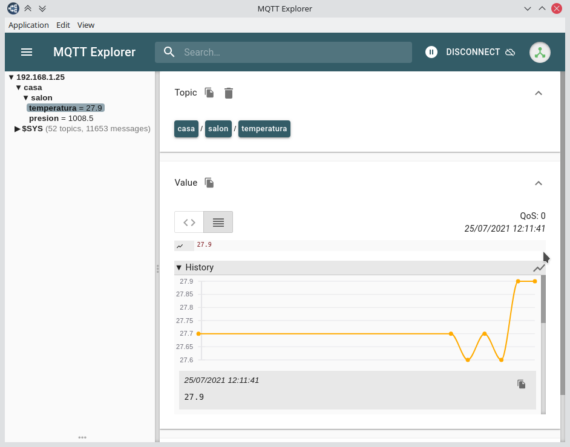

# Conectar un sensor BMP280 na Raspberry PI

Esta guía está baseada en https://learn.adafruit.com/adafruit-bmp280-barometric-pressure-plus-temperature-sensor-breakout/circuitpython-test

Moitos destes sensores véndense coa interface I2C ou coa SPI. A primeira é mais versátil, mentres a segunda é mais rápida. Máis info en [Selecting Between I2C and SPI for Your Project](https://www.lifewire.com/selecting-between-i2c-and-spi-819003)

Hai que activar a interface I2C na Raspberry usando a ferramenta `raspi-config`, xa que está desactivada por defecto. O proceso pode ser algo complicado se non temos unha instalación fresca de Raspbian. Máis detalles en [Adafruit's Raspberry Pi Lesson 4. GPIO Setup](https://learn.adafruit.com/adafruits-raspberry-pi-lesson-4-gpio-setup/configuring-i2c)

## Conexión entre RPi e BMP280

### Cableado (vale tamén para NodeMCU ou Arduino)
Hai 4 cables que unen o sensor BMP280 co porto I2C. Dous son para a alimentación e outros dous para a transmisión de datos. Resulta bastante práctico para isto usar cable telefónico de 4 fios, que se pode estender varios metros sen problema, aínda que as unións son un pouco fráxiles:

Módulo BMP280 | Raspberry Pi | Node MCU | Arduino | Función
------------ | -------------| -------------| -------------| -------------
3v3/5v (Vermello)  | 3v3 | 3v3| 3v3 | Alimentación
GND (Negro) | GND | GND | GND |Terra
S __D__ A (Verde) | SDA – Pin 3  | SDA – D2 | SDA – A4 | Datos ( __D__ ata)
S __C__ L (Amarelo) | SCL – Pin 5 | SCL – D1 | SCL – A5 | Reloxo (__C__ lock)

### Software

#### Comunicación entre RPi e BMP280

Instalamos os paquetes `python-smbus` e `i2c-tools`

    # apt-get install -y python-smbus i2c-tools
    # raspi-config <-- acceder á opción 5 Interfacing Options

Comprobamos que todo funciona ben cos seguintes comandos:

    $ ls /dev/i2c* /dev/spi*
    ls: cannot access '/dev/spi*': No such file or directory
    /dev/i2c-1

A resposta informanos de que temos activado o bus i2c nº1, pero non o bus SPI (tal como esperábamos)

    $ i2cdetect -y 1
     0  1  2  3  4  5  6  7  8  9  a  b  c  d  e  f
    [...]
    70: -- -- -- -- -- -- 76 --

Agora obtemos como resposta que temos un dispositivo conectado no enderezo 0x76

Instalamos os drivers de Adafruit na Raspberry a través como paquetes PIP de Python. Se non o temos, debemos instalar a versión 3 do xestor de paquetes PIP:

    # apt-get install python3-pip

No meu caso a execución baixo o usuario normal ($) da erros, así que fíxeno co superusuario (#):

    $ sudo su
    # pip3 install RPI.GPIO
    # pip3 install adafruit-circuitpython-busdevice
    # pip3 install adafruit-circuitpython-bmp280
    # pip3 install adafruit-blinka

Podemos comprobar se todo foi ben executando o script-python de exemplo para probar a [biblioteca `blinka` de Adafruit](https://learn.adafruit.com/circuitpython-on-raspberrypi-linux/installing-circuitpython-on-raspberry-pi)

    $ python3 blinka_test.py
    Hello blinka!
    Digital IO ok!
    I2C ok!
    SPI ok!
    done!

Agora só falta escribir un script en Python para facer as lecturas do sensor, [semellante a este de Adafruit](https://learn.adafruit.com/adafruit-bmp280-barometric-pressure-plus-temperature-sensor-breakout/circuitpython-test).
Eu tiven que indicar o enderezo `0x76` para a lectura do sensor, diferente ao `0x77` que trae por defecto.
Para corroborar que o sensor funciona ben, podes usar o script `BMP280_test.py` baseado no anterior.

    $ python3 test/BMP280_test.py

    Temperature: 27.6 C
    Pressure: 1008.4 hPa
    Altitude = 39.99 meters

Con este sensor resta calibralo para que ofreza a presión relativa adecuada, e configuralo en modo `forced` para que non estea facendo miles de lecturas por minuto, o que consume enerxía innecesaria e ademais quenta o sensor.

#### Comunicación entre MQTT e BMP280

Tomando como base o script de Adafruit fixen o script [BMP280_mqtt.py](sensors/BMP280_mqtt.py) que se encarga de tomar as lecturas do sensor e publicalas en MQTT. Terás que modificalo para poñer o enderezo IP do broker MQTT que vaias usar (o da Raspberry) e

Terás que instalar a biblioteca de python para usar o MQTT, se é que aínda non o fixeches anteriormente. En principio, é suficiente con facelo co usuario `pi`:

    $ pip3 install paho-mqtt

Debes modificar `BMP280_mqtt.py` para incluir o enderezo IP do broker MQTT, que no noso caso é o a Raspberry Pi, e tamén indicar os topics nos que se van publicar as mensaxes de presión e temperatura. Este script colocarémolo en `/home/pi/sensors/` (se queres cambiar a localización, deberás modificar tamén o script de systemd). Podes executalo manualmente con

    $ python3 sensors/BMP280_mqtt.py

Os datos son publicados nos _topic_ `casa/salon/temperatura` e  `casa/salon/presion` cada 5 minutos.

#### Execución automática

Para non ter que iniciar o script de forma manual automatizaremos a súa execución definindo un servizo de Systemd, que é unha das maneiras que temos en Linux para estas operacións.

O arquivo [bmp_mqtt.service](services/bmp_mqtt.service) colocarémolo en `/lib/systemd/system/`. É o que se encarga de iniciar o script en cada arranque da máquina.

    # cp bmp_mqtt.service /lib/systemd/system/

Unha vez que o arquivo `bmp_mqtt.service` está no cartafol `/lib/systemd/system/` temos que rexistrar o servizo en __Systemd__, comprobar o funcionamento e activar o inicio automático en cada inicio do sistema:

    # systemctl daemon-reload
    # systemctl start bmp_mqtt.service
    # systemctl status bmp_mqtt.service
    bmp_mqtt.service - BMP280 Pressure and Temperature Sensor Reading and MQTT Communication
    Loaded: loaded (/lib/systemd/system/bmp_mqtt.service; enabled; vendor preset: enabled)
    Active: active (running) since Wed 2021-03-31 20:17:12 CEST; 1 day 22h ago
     Main PID: 579 (python3)
    Tasks: 1 (limit: 4915)
     CGroup: /system.slice/bmp_mqtt.service
           └─579 /usr/bin/python3 /home/pi/sensors/BMP280_mqtt_i2c_pi.py
    Mar 31 20:17:12 raspinha-USB systemd[1]: Started BMP280 Pressure and Temperature Sensor Reading and MQTT Communication.

    # systemctl enable bmp_mqtt.service

Podemos reiniciar a máquina con `# reboot` e comprobar se temos lecturas do sensor no broker mqtt usando, por exemplo, o MQTT Explorer no PC:

